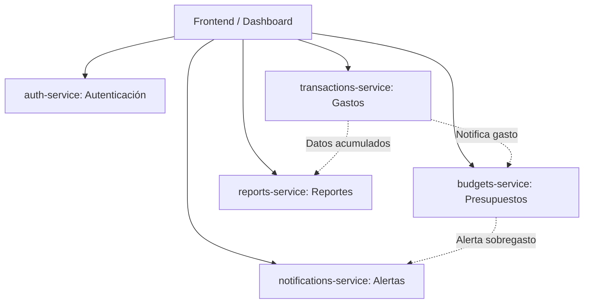

# Centavo 🪙

**Centavo** es una aplicación de finanzas personales para uso individual, orientada a registrar gastos, gestionar presupuestos y emitir alertas tempranas de sobregasto.

El proyecto está diseñado bajo una arquitectura de microservicios contenida en este monorepo, separando las responsabilidades de dominio para asegurar escalabilidad, modularidad e independencia técnica.

---

## 🏛️ Arquitectura del Sistema

A continuación se presenta un diagrama de arquitectura simple que describe la relación entre el frontend (Dashboard), los microservicios y sus interacciones principales:

---

## 📦 Estructura del Monorepo y Propósito de cada Componente

| Módulo / Servicio | Propósito | Responsabilidades Clave |
| :--- | :--- | :--- |
| **`frontend/`** | **Dashboard & UI** | Interfaz de usuario intuitiva y responsive. Permite la visualización de balances, carga de transacciones, configuración de metas/presupuestos y lectura de alertas y reportes. |
| **`auth-service/`** | **Autenticación** | Gestión de identidad del usuario, emisión y validación de tokens (JWT), control de acceso y seguridad de credenciales. |
| **`transactions-service/`** | **Transacciones** | Registro, edición, eliminación y categorización de movimientos financieros (ingresos y gastos). Actúa como fuente de verdad del historial transaccional. |
| **`budgets-service/`** | **Presupuestos** | Definición y seguimiento de presupuestos por categoría y periodo (mensual, semanal). Compara el gasto acumulado en tiempo real contra los umbrales fijados. |
| **`notifications-service/`** | **Alertas** | Monitoreo y entrega de advertencias al usuario cuando se acerca al límite o se produce un sobregasto en un presupuesto. Soporta notificaciones in-app, correo electrónico o push. |
| **`reports-service/`** | **Reportes** | Agregación de métricas y generación automática de balances periódicos (mensuales/anuales), exportaciones (PDF/CSV) y análisis de tendencias de consumo. |

